# WHB04B-6 CNC Pendant Controller

A .NET 8 library and console application for interfacing with the WHB04B-6 wireless CNC pendant remote controller via USB. Provides a strongly typed high level API that wraps the OEM `PHB04B.dll` library.

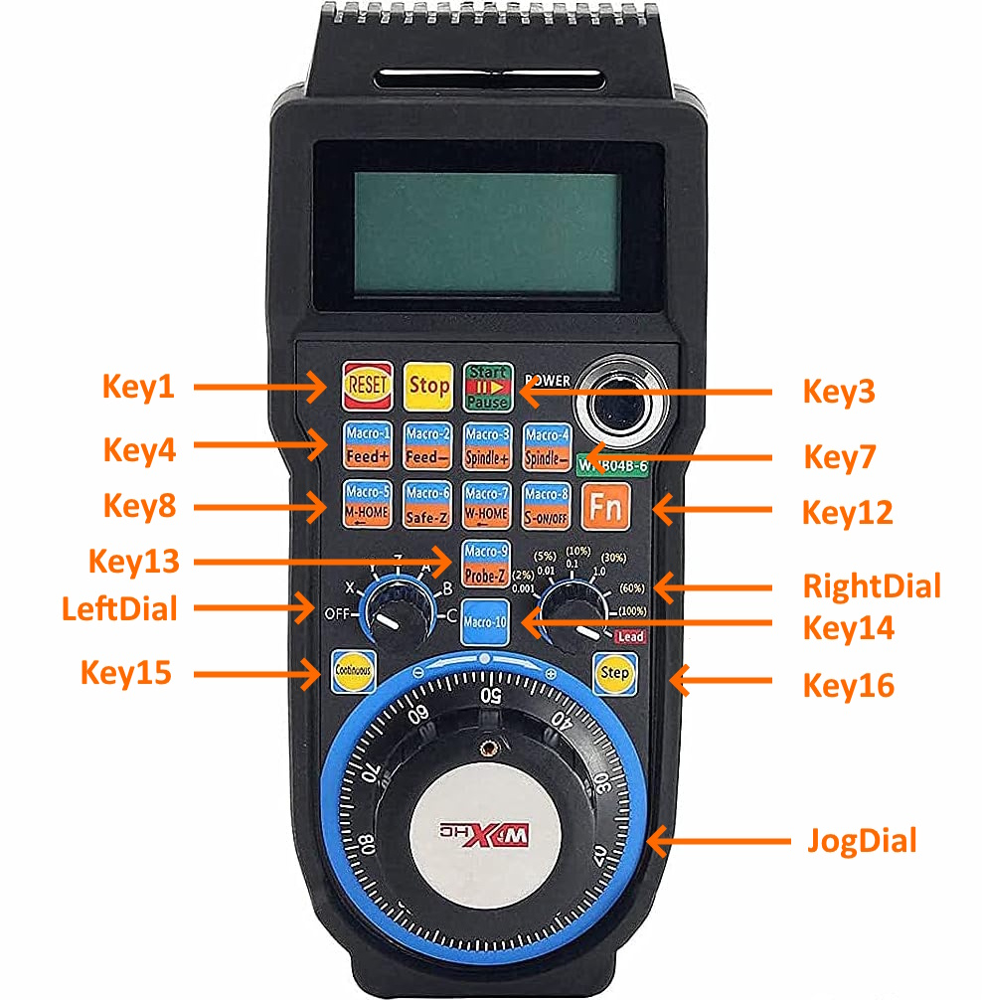

## Application
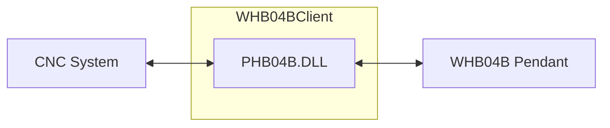

## Features

- **USB Communication**: Direct communication with WHB04B-6 pendant through USB controller
- **Real-time Input Processing**: Continuously polls pendant for button presses, dial positions, and jog wheel movements
- **Display Output**: Send coordinate data and control information to the pendant's LCD display
- **Modern C# Implementation**: Built with .NET 8, using latest C# features and best practices
- **Exception Handling**: Comprehensive error handling with specific exception types for pendant operations

## Hardware Requirements

- WHB04B-6 wireless CNC pendant
- USB receiver/controller for the pendant
- Windows operating system (required for USB driver)

## Project Structure

- `WHB04BClient.csproj` - Project file for .NET 8 application
- `PHB04BLibrary.cs` - Low-level P/Invoke wrapper for the PHB04B.dll
- `WHB04BClient.cs` - High-level managed client with automatic polling and event handling
- `PendantInputData.cs` - Classes for parsing pendant input (buttons, dials, jog wheel)
- `PendantDisplayData.cs` - Classes for formatting display output data
- `PHB04BException.cs` - Custom exception types for pendant operations
- `Program.cs` - Console application demonstrating library usage

## Usage

### Basic Example

```csharp
using var controller = new WHB04BClient();

// Subscribe to input events
controller.DataChanged += (sender, e) =>
{
    Console.WriteLine($"[{e.Timestamp:HH:mm:ss.fff}] " +
                     $"Key1: {e.FirstKeyPressed} | Key2: {e.SecondKeyPressed} | " +
                     $"RightDial: {e.RightDial} | LeftDial: {e.LeftDial} | " +
                     $"Jog: {e.JogCountOffset}");
};

// Send display data
var displayData = new PendantDisplayData(
    JogMode.Continuous,
    CoordinateSystem.XYZ,
    x: 123.4567m,
    y: -98.7654m,
    z: 0.1234m
);

controller.SendDisplayData(displayData);
```

### Input Data

The pendant provides the following data through the `PendantInputData` event:

- **Timestamp** (`DateTime`) - When the data was received
- **FirstKeyPressed** (`KeyPressed`) - Primary button press (`Key1` - `Key16`, `None`, `Unknown`)
- **SecondKeyPressed** (`KeyPressed`) - Secondary button press(`Key1` - `Key16`, `None`, `Unknown`)
- **RightDial** (`DialPosition`) - Right rotary dial position (`Position1` - `Position7`, `Unknown`)
- **LeftDial** (`DialPosition`) - Left rotary dial position (`Position1` - `Position7`, `Unknown`)
- **JogCountOffset** (`int`) - Jog wheel movement offset since last poll (`-128` to `+127`)

## Display Output

### Coordinate Values
Display accepts any values for X, Y and Z positions. Range: ±65535.9999

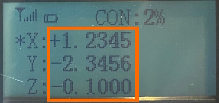

**⚠️ Important:** The pendant display will not update if the left dial is in `Position1` (Off). Ensure the left dial is set to Position2 or higher for display data to be visible.

### Jog Mode
Display accepts any one of 4 choices:

#### None
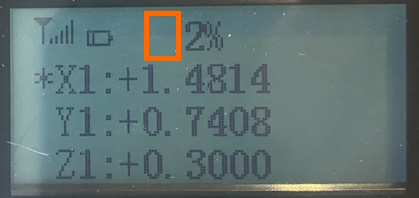

#### Continuous
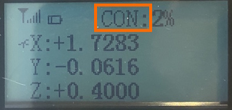

#### Step
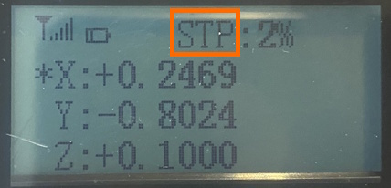

#### Reset
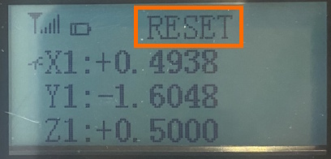

### Coordinate System
Display accepts any one of 2 choices:

#### X, Y, Z / A, B, C
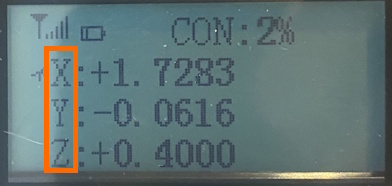

#### X1, Y1, Z1 / A1, B1, C1
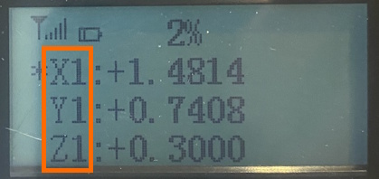

#### Selected Axis
Always matches the chosen option in the left dial.

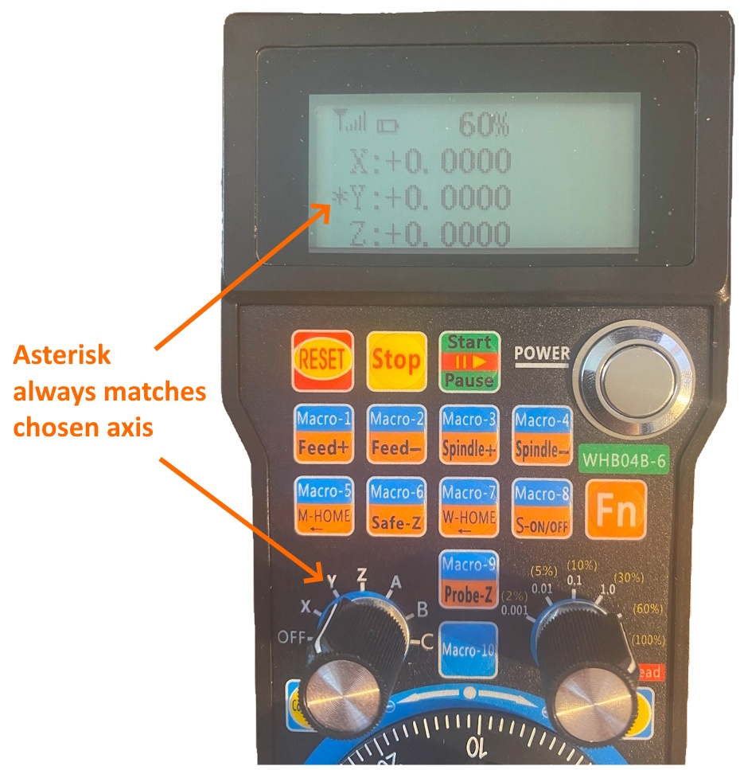

#### Primary (XYZ) / Secondary (ABC) Axis 
Axis names shown always match chosen option in the left dial.

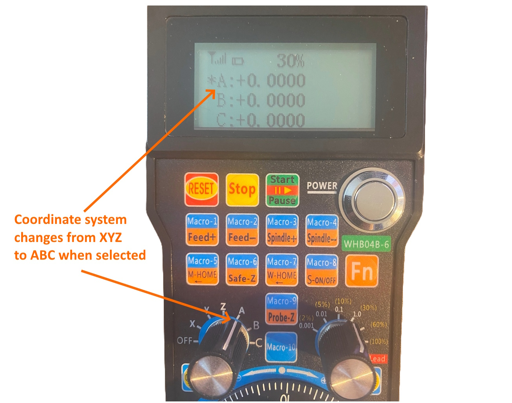

#### Percentage
Percentage always matches chosen option in the right dial.

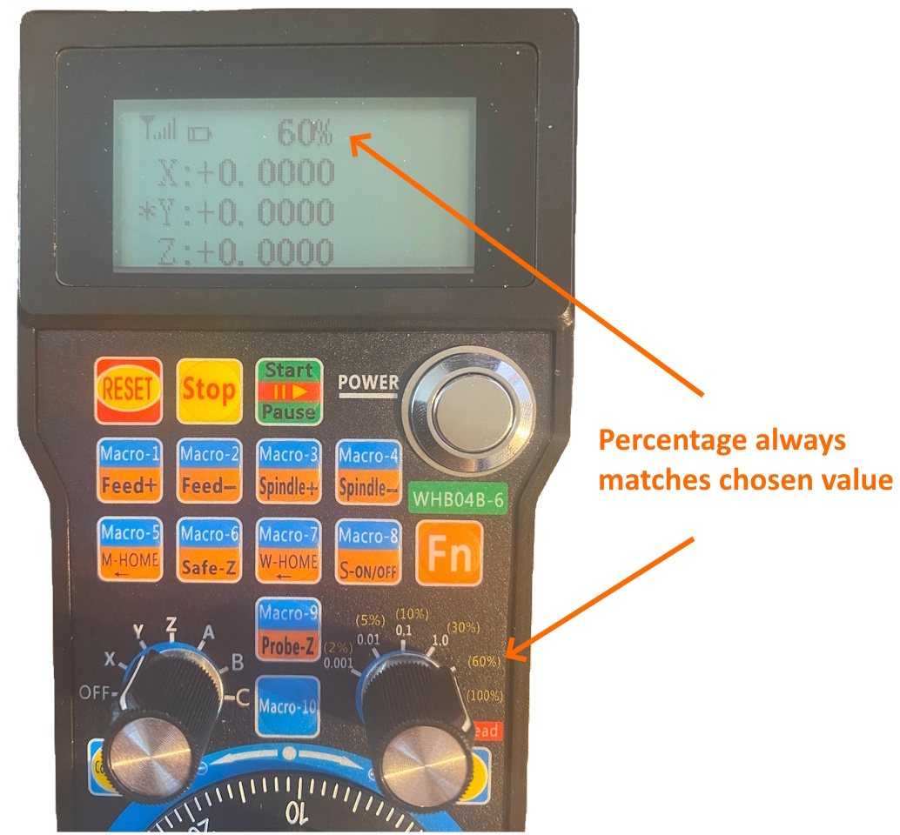

## Building

Requires .NET 8 SDK:

```bash
dotnet build
```

## Running

```bash
dotnet run
```

The console application will:
1. Initialize the pendant controller
2. Display real-time input data from the pendant
3. Send sample coordinate data to the pendant display every 10 seconds
4. Run until Ctrl+C is pressed

## Dependencies

- .NET 8.0
- `PHB04B.dll` (native USB driver - must be in application directory)
- Windows x86 platform (required for USB driver compatibility)

## Future changes
- Replace `PHB04B.dll` dependency with direct HID driver implementation.

## License

See LICENSE file for details.