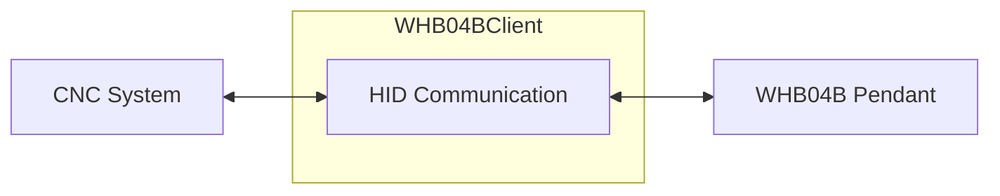

# WHB04B-6 CNC Pendant Controller

A .NET 8 library and console application for interfacing with the WHB04B-6 wireless CNC pendant remote controller via USB. Provides a strongly typed high level API using direct HID communication (no longer requires vendor PHB04B.dll).


## Application


## Features

- **Direct HID Communication**: Native USB HID communication with WHB04B-6 pendant (no vendor DLL required)
- **Real-time Input Processing**: Continuously polls pendant for button presses, dial positions, and jog wheel movements
- **Display Output**: Send coordinate data and control information to the pendant's LCD display
- **Modern C# Implementation**: Built with .NET 8, using latest C# features and best practices
- **Exception Handling**: Comprehensive error handling with specific exception types for pendant operations

## Hardware Requirements

- WHB04B-6 wireless CNC pendant
- USB receiver/controller for the pendant
- Cross-platform compatible (Windows, Linux, macOS)

## Project Structure

- `WHB04BClient.csproj` - Project file for .NET 8 application
- `HidCommunication.cs` - Direct HID communication implementation using HidSharp library
- `WHB04BClient.cs` - High-level managed client with automatic polling and event handling
- `PendantInputData.cs` - Classes for parsing pendant input (buttons, dials, jog wheel)
- `PendantDisplayData.cs` - Classes for formatting display output data
- `HidCommunicationException.cs` - Custom exception types for HID communication operations
- `Program.cs` - Console application demonstrating library usage

## Usage

### Basic Example

```csharp
using var controller = new WHB04BClient();

// Subscribe to input events
controller.DataChanged += (sender, e) =>
{
    Console.WriteLine($"[{e.Timestamp:HH:mm:ss.fff}] " +
                     $"Key1: {e.FirstKeyPressed} | Key2: {e.SecondKeyPressed} | " +
                     $"RightDial: {e.RightDial} | LeftDial: {e.LeftDial} | " +
                     $"Jog: {e.JogCountOffset}");
};

// Send display data
var displayData = new PendantDisplayData(
    JogMode.Continuous,
    CoordinateSystem.XYZ,
    number1: 123.4567m,  // X coordinate
    number2: -98.7654m,  // Y coordinate
    number3: 0.1234m,    // Z coordinate
    feedRate: 120,       // 120% feed rate (displayed as "F:120")
    spindleRate: 1200    // 1200 RPM (displayed as "S:1200")
);

controller.SendDisplayData(displayData);
```

### Input Data

The pendant provides the following data through the `PendantInputData` event:

- **Timestamp** (`DateTime`) - When the data was received
- **FirstKeyPressed** (`KeyPressed`) - Primary button press (`Key1` - `Key16`, `None`, `Unknown`)
- **SecondKeyPressed** (`KeyPressed`) - Secondary button press(`Key1` - `Key16`, `None`, `Unknown`)
- **RightDial** (`DialPosition`) - Right rotary dial position (`Position1` - `Position7`, `Unknown`)
- **LeftDial** (`DialPosition`) - Left rotary dial position (`Position1` - `Position7`, `Unknown`)
- **JogCountOffset** (`int`) - Jog wheel movement offset since last poll (`-128` to `+127`)

## Display Output

### Coordinate Values
Display accepts any values for X, Y and Z positions. Range: ±65535.9999


**⚠️ Important:** The pendant display will not update if the left dial is in `Position1` (Off). Ensure the left dial is set to Position2 or higher for display data to be visible.

### Jog Mode
Display accepts any one of 4 choices:

#### None


#### Continuous


#### Step


#### Reset


### Coordinate System
Display accepts any one of 2 choices:

#### X, Y, Z / A, B, C


#### X1, Y1, Z1 / A1, B1, C1


#### Selected Axis
Always matches the chosen option in the left dial.


#### Primary (XYZ) / Secondary (ABC) Axis 
Axis names shown always match chosen option in the left dial.


#### Percentage
Percentage always matches chosen option in the right dial.


## Building

Requires .NET 8 SDK:

```bash
cd src
dotnet build
```

## Running

```bash
cd src
dotnet run
```

The console application will:
1. Initialize the pendant controller
2. Display real-time input data from the pendant
3. Send sample coordinate data to the pendant display every 10 seconds
4. Run until Ctrl+C is pressed

## Dependencies

- .NET 8.0
- HidSharp NuGet package (cross-platform HID library)

## Changes Made

- ✅ Replaced `PHB04B.dll` dependency with direct HID communication using HidSharp
- ✅ Updated input packet parsing to handle 8-byte HID packets (vs 5-byte vendor format)  
- ✅ Updated output packet generation to create 21-byte HID compatible format
- ✅ Mapped all button key codes to match LinuxCNC implementation exactly
- ✅ Cross-platform compatibility (no longer Windows-only)
- ✅ Added support for feed rate and spindle speed display (F:xxx and S:xxxx)

## Acknowledgments

This implementation is based on the excellent reverse engineering work done by the LinuxCNC community for the XHC WHB04B-6 pendant. Special thanks to:

- **Raoul Rubien** (github.com/rubienr) - Original author of the LinuxCNC xhc-whb04b-6 component
- **alkabal_free.fr** - Updated the LinuxCNC component for LinuxCNC 2020
- **LinuxCNC Project** - For the open-source CNC control software and community
- **Machinekit contributors** - Listed at https://github.com/machinekit/machinekit/graphs/contributors

The USB protocol documentation, button mappings, and HID communication patterns used in this .NET implementation are derived from their reverse engineering efforts documented in the LinuxCNC xhc-whb04b-6 component.

Source code for the LinuxCNC xhc-whb04b-6 component: https://github.com/LinuxCNC/linuxcnc/tree/master/src/hal/user_comps/xhc-whb04b-6

## License

See LICENSE file for details.

**Note:** This project is not associated or endorsed by Chengdu Xinhecheng Technology Co.,Ltd.
